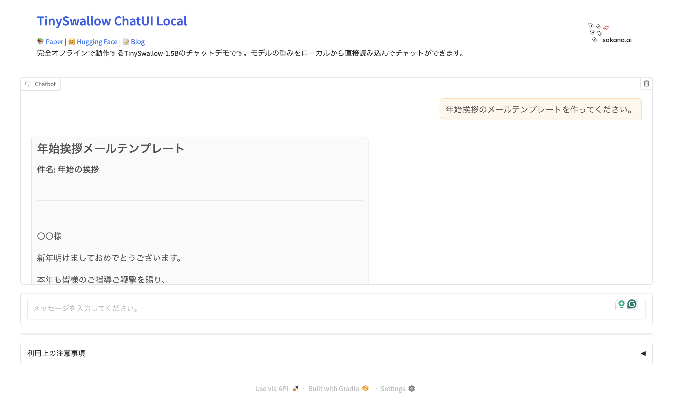

# TinySwallow ChatUI Local

📚 [Paper](https://arxiv.org/abs/2501.16937) | 🤗 [Hugging Face](https://huggingface.co/collections/SakanaAI/tinyswallow-676cf5e57fff9075b5ddb7ec) | 📝 [Blog](https://sakana.ai/taid-jp)

<div align="center">

</div>

完全オフラインで動作するTinySwallow-1.5Bのチャットデモです。[Gradio](https://www.gradio.app/)のUIを用いて、ローカルからモデルの重みを直接読み込んでチャットができます。

**特徴:**

- 📱 モデルの重みを直接ローカルから読み込み、完全オフラインで会話することも可能です。
- 🔐 すべての処理がローカルで実行されるため、データが外部に送信されることはありません。
- 💬 UIには[Gradio](https://www.gradio.app/)を用いており、すべてPythonで作成されています。

## 使い方

### 1. GitおよびGit LFSをインストール

モデルの重みをダウンロードするために、[Git](https://git-scm.com/book/ja/v2/%e4%bd%bf%e3%81%84%e5%a7%8b%e3%82%81%e3%82%8b-Git%e3%81%ae%e3%82%a4%e3%83%b3%e3%82%b9%e3%83%88%e3%83%bc%e3%83%ab)および[Git LFS](https://docs.github.com/ja/repositories/working-with-files/managing-large-files/installing-git-large-file-storage)をインストールします。
お使いのOSの指示に従ってインストールしてください。

### 2. リポジトリのクローン

`--recursive`オプションをつけてクローンすることで、モデルの重みも同時にダウンロードされます。

```bash
git lfs install
git clone --recursive https://github.com/SakanaAI/TinySwallow-ChatUI-Local.git
cd TinySwallow-ChatUI-Local
```

### 3. uvをインストール

[uv](https://docs.astral.sh/uv/getting-started/installation/#installation-methods)をインストールします。お使いのOSに合わせて、以下のコマンドを実行します。

**macOSの場合:**

ターミナルを開き、以下のコマンドを実行します。

```bash
curl -LsSf https://astral.sh/uv/install.sh | sh
```

**Windowsの場合:**

PowerShellを開き、以下のコマンドを実行します。

```bash
powershell -ExecutionPolicy ByPass -c "irm https://astral.sh/uv/install.ps1 | iex"
```

### 4. 必要なパッケージをインストール

```bash
uv sync
```

### 5. サーバーを起動

以下を実行すると、自動でアプリがブラウザに開かれます。

```bash
uv run app.py
```

## ブラウザベース版について

このWebアプリケーションでは、Pythonのライブラリを用いて、モデルの重みをローカルから読み込み、完全オフラインでチャットが可能です。

より手軽に試せるバージョンとして、HTMLとJavaScriptのみで動作する[TinySwallow-ChatUI](https://github.com/SakanaAI/TinySwallow-ChatUI)も公開しています。
デモは[こちら](https://pub.sakana.ai/tinyswallow/)からお試しいただけます。

## 利用上の注意

本アプリケーションは実験段階のプロトタイプであり、研究開発の目的でのみ提供されています。商用利用や、障害が重大な影響を及ぼす可能性のある環境（ミッションクリティカルな環境）での使用には適していません。 本アプリケーションの使用は、利用者の自己責任で行われ、その性能や結果については何ら保証されません。 Sakana AIは、本アプリケーションの使用によって生じた直接的または間接的な損失に対して、結果に関わらず、一切の責任を負いません。 利用者は、本アプリケーションの使用に伴うリスクを十分に理解し、自身の判断で使用することが必要です。
